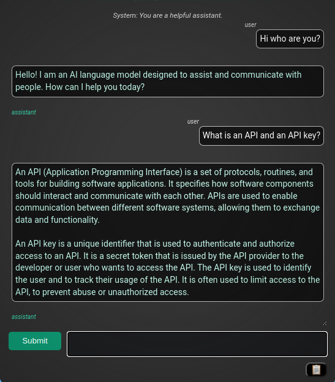

# GPT-Prompter

### Update (05/10/2024) 
- Added support for GPT-4-Turbo.
- Updated prompt list with Anki prompts.
- No present support for Instruct models.
- Live response streaming is back.

### Installation Instructions:
1. `git clone https://github.com/giosilvi/GPT-Prompter.git`
2. `cd` into the repository and type `npm run build`.
3. A new .zip file should appear in /zips. Unzip it!
4. Go to `chrome://extensions`. If you use Brave or another Chromium-based browser, replace the prefix with the name of your browser (e.g `brave://extensions`).
5. Click "Load unpacked" and select your newly unzipped folder:

### Usage:
1. Make a profile at [OpenAI](https://beta.openai.com/), if you haven't already
2. From https://beta.openai.com/account/api-keys you can copy your API Key and paste into the chrome extension (we never have access to your API Key, it is stored on your Chrome profile).
3. (Optional)Now just select text from a website.
4. Select from the context menu (right click) the GPT-Prompter command to send the custom prompt to open the popup. 
5. The default prompt is "Tell me more about <selected text>", but you can create anything you want with just the constrain that it has to contain a field for the selected text to be parsed in it.

